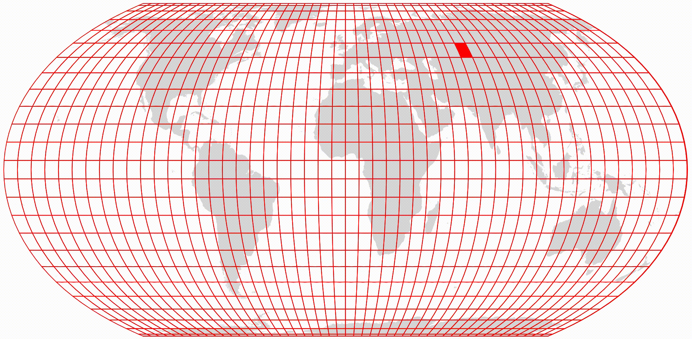

# Real time world flights situation

This Node.js project responsibly gathers real-time flight data worldwide using the amazing [flightradarapi](https://github.com/JeanExtreme002/FlightRadarAPI) package, solely for analytical purposes and without profit-driven intentions. The results are stored in CSV files for further analysis and visualization.

https://github.com/user-attachments/assets/fef56e0b-0ca7-4d09-88dd-6cad513d87a8

#### Grid Operation
The script generates a grid over the global map divided into cells of a specified size (800 km in this case). Each grid cell is represented as a quadrilateral bounded by geographical coordinates.

The grid approach is necessary due to API limitations where large area requests are capped at 1500 results. Even with this grid method, the 1500 result limit can still be reached, especially over densely populated areas like London or Germany.

#### Notes

The real-time flight visualization GIF is generated using a GitHub Actions workflow that updates every 15 minutes. Following this, the data is filtered to exclusively display results from the past 24 hours.
